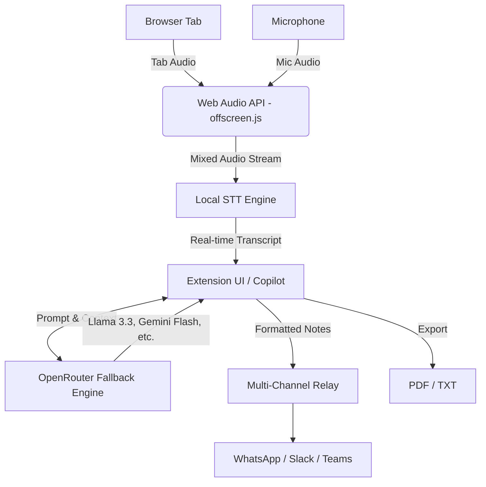

# ZeroScribe AI
**Zero-Backend Live Meeting Copilot & Multi-Channel Relay**

ZeroScribe AI is a powerful, zero-backend, browser-native extension designed to be your ultimate meeting companion. It runs directly in your browser, ensuring maximum privacy, zero server costs, and blazing-fast performance. By combining dual-audio capture, live transcription, and an advanced AI Copilot powered by an OpenRouter fallback engine, ZeroScribe AI ensures you never miss a critical detail in any meeting.

## 🌟 Key Features

### 🎙️ Advanced Audio Capture & Transcription
- **Universal Live Transcription:** Works natively on Google Meet, Zoom (Web), and Microsoft Teams without requiring host Closed Captioning (CC) permissions.
- **Dual Audio Capture:** Seamlessly mixes Tab Audio and Microphone Audio using the Web Audio API (via `offscreen.js`), capturing both sides of the conversation perfectly.
- **Speaker Attribution & Deduplication:** Intelligently identifies and assigns speakers, cleaning up overlapping dialogue.
- **In-Person Audio & File Uploads:** Supports drag-and-drop transcription of audio files utilizing Deepgram Nova-2 or OpenAI Whisper.

### 🧠 AI Copilot & OpenRouter Fallback Engine
- **Instant Quick Cues & Suggestions:** Features "Suggest Questions to Ask" and on-the-fly summary generation to keep you engaged.
- **OpenRouter Auto-Fallback Engine:** Never experience downtime. Automatically cascades through top-tier models: Llama 3.3 → Gemini Flash → DeepSeek R1 → Qwen 2.5 → Mistral.
- **Dynamic 2-Stage Persona & Meta-Prompting:** Highly tuned prompts adapt to the context of the meeting, providing accurate, contextual, and professional insights.

### 🚀 Multi-Channel Relay & Export
- **Multi-Channel Dispatch:** Push meeting notes and action items instantly. Includes WhatsApp Web auto-focus prefill, Slack Webhooks, and Microsoft Teams Webhooks.
- **Professional Exports:** Generate beautifully formatted PDF and TXT exports with custom branding.

### 🎨 Premium UI/UX
- **Raycast / Linear Aesthetic:** A sleek, keyboard-accessible dark mode UI.
- **Clean SVG Icon System:** Zero raw emojis. Clean, professional iconography throughout.

## 🏗️ Architecture

ZeroScribe AI leverages a modern, fully client-side architecture to minimize latency and protect privacy.



## ⚙️ Installation & Developer Guide

### Prerequisites
- Node.js (v18+)
- Chrome/Edge Browser (Manifest V3 compatible)
- OpenRouter API Key

### Setup
1. **Clone the repository:**
   ```bash
   git clone https://github.com/yourusername/ZeroScribeAI.git
   cd ZeroScribeAI
   ```
2. **Install dependencies:**
   ```bash
   npm install
   ```
3. **Build the extension:**
   ```bash
   npm run build
   ```
4. **Load into Chrome:**
   - Go to `chrome://extensions/`
   - Enable **Developer Mode** (top right).
   - Click **Load unpacked** and select the `dist` (or `build`) folder.

## 🛣️ Future Roadmap
- [ ] **Persistent Vector Brain:** Long-term memory for past meetings across sessions.
- [ ] **MemPalace / Knowledge Graph Integration:** Connecting entities, decisions, and action items across disparate meetings visually.
- [ ] **On-Device LLM Support:** Running lightweight quantized models (e.g., Llama.cpp) directly via WebGPU for true 100% offline capability.

---
*Built with precision and elegance.*
